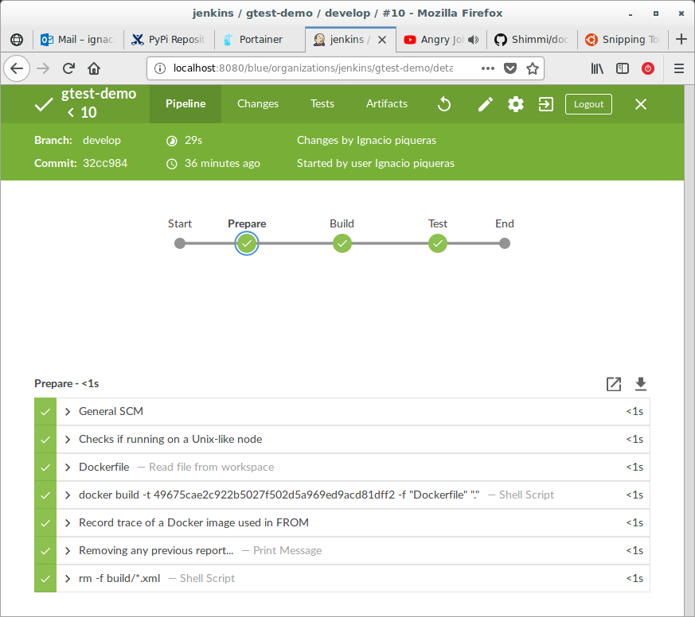
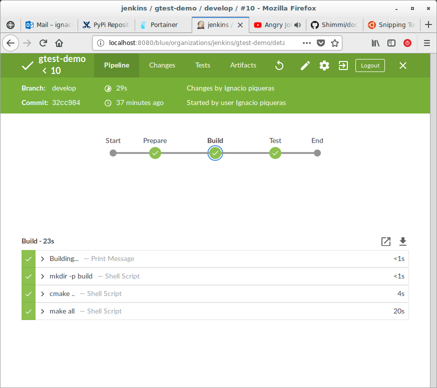
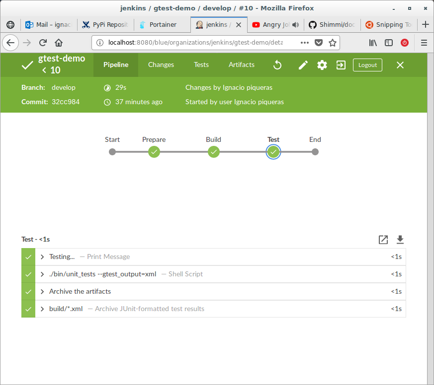

# CI example using Jenkins

The purpose of this example is to show how to use Jenkins Pipelines to execute
unit tests on C++ code that sets Google Test and uses CMake to build and fetch
the Google Test library.

The code is built using a Docker image that gets run by Jenkins trough a 
*Docker agent*. Instead of pulling an image from a Docker Hub, Jenkins builds
the image from a `Dokerfile` and runs any step though the container.

Ideally it would be better to have one image configured to build each component,
or a generic image that is able to build most of the SW components in a project.
This way we avoid the overhead of building the image (don't know whether
Jenkins caches the images/containers created this way)

Using Docker to build and test the SW ensures that the host running Jenkins 
(either master or slave) does not get *polluted* with libraries and tools
required to build several SW components.

## Running the example

To run the example I set up a Docker image that contained Jenkins, Docker and
the Blue Ocean extension. Don't know why, I could not make work docker under the
official [Docker image of Jenkins](https://hub.docker.com/r/jenkinsci/blueocean)

I made it work using the image provided by 
[Docker-Jenkins (git)](https://github.com/Shimmi/docker-jenkins)

To run the example just type:

~~~
$ docker run -u root --mount
type=bind,source=/home/ignacio-piqueras/garage,target=/garage -p 8080:8080 -v /home/ignacio-piqueras/jenkins_home:/var/jenkins_home -v /var/run/docker.sock:/var/run/docker.sock --group-add docker shimmi/jenkins
~~~

The bind mount from my local directory to the `/garage` directory in the
container was to enable Jenkins to configure a local git repository.

### Results

After setting up a pipeline job that uses `/garage/root/to/git/gtest-demo` as 
source SCM...

## Links

 * [Using Docker with Pipeline](https://jenkins.io/doc/book/pipeline/docker/)
 * [Docker-Jenkins](https://github.com/Shimmi/docker-jenkins)
 * [GTest example](https://github.com/bast/gtest-demo)